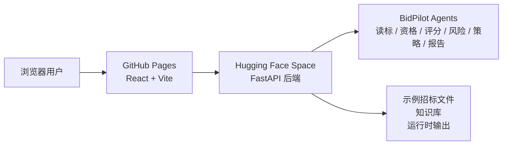

# BidPilot

面向政企信息化项目的投标智能 Agent 工作台。

BidPilot 聚焦软件、数据平台、政务服务、智慧园区等招投标场景，帮助投标团队完成读标、资格条件梳理、废标风险识别、评分规则分析、投标策略生成、响应表整理、标书初稿和合规复核。

当前网页版已经接入真实后端服务：

- Web 入口：<https://athena-fusion.github.io/BidPilot/>
- 后端健康检查：<https://jiehu-claire-bidpilot-api.hf.space/api/health>
- 后端 API 文档：<https://jiehu-claire-bidpilot-api.hf.space/docs>

说明：当前 Hugging Face 后端运行在 `MOCK_MODE=true`，也就是“真实 FastAPI 后端 + 规则化演示分析”。它不是纯前端静态假数据；浏览器会真实请求后端 API。若要接入真实大模型，需要在后端环境中配置 `LLM_API_KEY`、`LLM_BASE_URL` 等变量。

## 核心能力

- 招标摘要：提取项目名称、采购人、预算、截止时间、服务周期、保证金、采购范围等信息。
- 资格要求：识别资质、人员、业绩、格式、商务和技术要求，并给出风险等级。
- 评分分析：拆解技术分、商务分、价格分，标出高权重得分项。
- 风险审查：覆盖价格超限、保证金、签字盖章、资质材料、星号条款、格式要求等常见废标风险。
- 投标策略：输出参与建议、胜算判断、报价提示、材料清单和管理层摘要。
- 标书生成：生成技术方案章节、商务响应、技术响应表、偏离表和报告预览。
- 合规复核：汇总致命问题、警告项、人工确认项和免责声明。
- Agent Trace：展示每一步由哪个 Agent 执行，便于复盘和演示。

## 在线架构



前端支持两种模式：

- 真实后端模式：设置 `VITE_API_BASE_URL` 后，所有 API 请求都走指定后端。当前 GitHub Pages 使用此模式。
- 静态演示模式：生产构建未设置 `VITE_API_BASE_URL` 时，才使用前端内置演示数据。

线上构建已经强制接入：

```text
https://jiehu-claire-bidpilot-api.hf.space/api
```

## 技术栈

- 前端：React 18、TypeScript、Vite 8、Tailwind CSS、Lucide React
- 后端：Python 3.12、FastAPI、Pydantic v2、httpx、python-docx、pypdf
- 部署：GitHub Pages 托管前端，Hugging Face Docker Space 托管后端
- CI/CD：GitHub Actions 构建前端并发布 `gh-pages` 分支

## 目录结构

```text
backend/                  FastAPI 后端、Agent 编排、数据模型、服务和测试
backend/data/             示例招标文件、知识库、运行时输出目录
frontend/                 React/Vite 网页端
deploy/huggingface/       Hugging Face Docker Space 部署文件
docs/                     部署、演示、价值说明和适配文档
examples/                 示例输入与输出摘要
.github/workflows/        CI 和 GitHub Pages 发布流程
```

## 本地运行

### 后端

```bash
cd backend
python -m venv .venv

# Windows
.venv\Scripts\activate

# macOS / Linux
source .venv/bin/activate

pip install -r requirements.txt
uvicorn main:app --reload --port 8000
```

常用地址：

- `http://localhost:8000/`
- `http://localhost:8000/docs`
- `http://localhost:8000/api/health`

### 前端

```bash
cd frontend
npm install
npm run dev
```

本地开发时，Vite 会把 `/api` 代理到 `http://localhost:8000`。

如果希望本地前端直接连接线上 Hugging Face 后端：

```powershell
cd frontend
$env:VITE_API_BASE_URL="https://jiehu-claire-bidpilot-api.hf.space/api"
npm run build
npm run preview
```

## 环境变量

### 后端

| 变量名 | 默认值 | 说明 |
| --- | --- | --- |
| `MOCK_MODE` | `true` | 使用规则化演示分析，不调用模型 API。 |
| `OPENAI_COMPATIBLE_MODE` | `false` | 启用 OpenAI 兼容接口调用。 |
| `CUSTOM_MODEL_MODE` | `false` | 启用自定义模型模式。 |
| `LLM_API_KEY` | 空 | 模型 API Key，生产环境应放在 Secret 中。 |
| `LLM_BASE_URL` | 空 | OpenAI 兼容接口 Base URL。 |
| `LLM_MODEL` | `deepseek-v4-flash` | 调用的模型名称。 |
| `BACKEND_HOST` | `0.0.0.0` | 后端监听地址。 |
| `BACKEND_PORT` | 本地 `8000` / HF `7860` | 后端监听端口。 |
| `DATA_DIR` | `backend/data` | 数据目录。 |
| `OUTPUT_DIR` | `backend/data/outputs` | 报告输出目录。 |

### 前端

| 变量名 | 默认值 | 说明 |
| --- | --- | --- |
| `VITE_API_BASE_URL` | 空 | 后端 API 根路径。线上 Pages 设置为 `https://jiehu-claire-bidpilot-api.hf.space/api`。 |

不要把真实 API Key、客户资料、招标敏感文件、证件、私钥、恢复码等提交到仓库。

## 部署

### 前端：GitHub Pages

`.github/workflows/deploy-pages.yml` 会执行：

1. 使用 Node 24 安装前端依赖。
2. 构建前端，并注入 Hugging Face 后端地址。
3. 只发布 `frontend/dist` 到 `gh-pages` 分支。

### 后端：Hugging Face Space

后端部署为 Docker Space：

- Space：`Jiehu-Claire/bidpilot-api`
- 运行地址：<https://jiehu-claire-bidpilot-api.hf.space>
- 部署文件：`deploy/huggingface/`

提交到 `main` 后，`.github/workflows/deploy-backend.yml` 会先构建并启动生产 Docker 镜像进行健康检查，再同步后端目录到该 Space。首次启用前，在 GitHub 仓库 Actions secrets 中添加具有该 Space 写入权限的 `HF_TOKEN`；未配置时，工作流会明确标记“跳过同步”而不会伪造部署成功。

上传后端到 Space 的参考命令：

```powershell
$stage = Join-Path $env:TEMP "bidpilot-hf-space"
if (Test-Path $stage) { Remove-Item -LiteralPath $stage -Recurse -Force }
New-Item -ItemType Directory -Path $stage | Out-Null
Copy-Item deploy\huggingface\Dockerfile (Join-Path $stage "Dockerfile")
Copy-Item deploy\huggingface\README.md (Join-Path $stage "README.md")
Copy-Item backend (Join-Path $stage "backend") -Recurse
Get-ChildItem $stage -Recurse -Directory -Filter __pycache__ | Remove-Item -Recurse -Force
Get-ChildItem $stage -Recurse -File -Include *.pyc,*.pyo | Remove-Item -Force
hf upload Jiehu-Claire/bidpilot-api $stage . --repo-type space --commit-message "deploy bidpilot backend"
```

## 验证

本地检查：

```bash
cd frontend
npm audit --audit-level=moderate
npm run build

cd ..
python -m pytest backend/tests
```

远端检查：

```bash
curl https://jiehu-claire-bidpilot-api.hf.space/api/health
curl https://athena-fusion.github.io/BidPilot/
```

后端健康检查应返回：

```json
{"status":"ok","mock_mode":true,"version":"0.1.0"}
```

## 许可

本项目基于 [MIT License](LICENSE) 发布。
