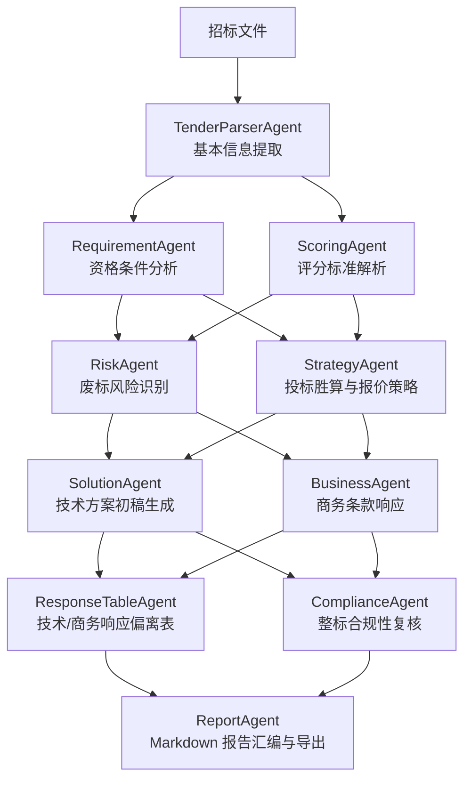

# BidPilot 🚀

> **面向政企信息化项目的投标智能多 Agent 协同系统**

BidPilot 是一款专注于政企软件与信息化项目招投标场景的行业级 Agent 工作台。它通过结构化多 Agent 协同，实现读标、废标风险识别、评分分析、投标策略生成、响应表及标书初稿自动生成的完整业务闭环。

---

## 💡 核心价值

* **高效读标**：100+ 页招标文件分析，从 4 小时缩短至 15 分钟。
* **精准避坑**：覆盖报价超限、资质不符、签章遗漏、保证金缺失及 ★ 号条款响应。
* **一键响应**：自动生成格式合规的技术响应表、偏离表及 13 章节标书技术方案初稿。

---

## 🤖 多 Agent 协同架构

系统采用多 Agent 分工协同与可追溯设计，每一个业务步骤均有 trace 支撑。



---

## 🛠️ 技术栈

* **后端**：Python 3.10+ · FastAPI · Pydantic v2 · httpx (兼容 OpenAI 标准接口)
* **前端**：React 18 · TypeScript · Vite · TailwindCSS · Lucide-React
* **部署**：支持 Docker 单容器部署 / GitHub Pages 静态托管 (支持 Mock 离线演示)

---

## 🚀 快速开始

### 后端服务
```bash
cd backend
python -m venv .venv
# Windows 下激活虚拟环境: .venv\Scripts\activate
# Linux/Mac 下激活虚拟环境: source .venv/bin/activate
pip install -r requirements.txt
uvicorn main:app --reload --port 8000
```
* API 文档：`http://localhost:8000/docs`
* 健康检查：`http://localhost:8000/api/health`

### 前端服务
```bash
cd frontend
pnpm install
pnpm dev
```
* 访问地址：`http://localhost:5173`

---

## ⚙️ 环境变量配置

复制根目录的 `.env.example` 为 `.env` 进行配置：

| 变量名 | 默认值 | 说明 |
| :--- | :--- | :--- |
| `MOCK_MODE` | `true` | Mock 演示模式 (无需配模型 API，直接输出高质量模拟结果) |
| `OPENAI_COMPATIBLE_MODE` | `false` | 启用 OpenAI 兼容接口模式 |
| `LLM_API_KEY` | - | 语言模型 API Key |
| `LLM_BASE_URL` | - | 语言模型 API Base URL |
| `LLM_MODEL` | `deepseek-v4-flash` | 调用模型名称 |

---

## 📄 授权协议

本项目基于 [MIT License](LICENSE) 协议开源。
